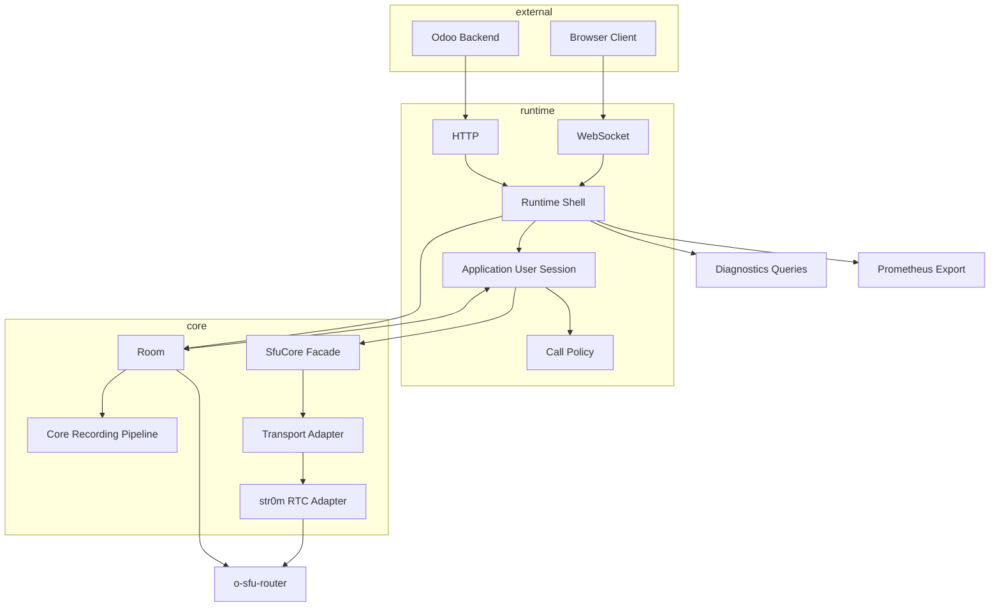

# o-sfu

The goal is to be able to run it as an alternative to odoo/sfu (so the http and ws API and client bundle API are the same), but with:
- higher control on routing
- better recording integration (no port publishing to ffmpeg)
- better scaling architecture (local and multi server sharding)
- more observability (prometheus, open telemetry,...)
- stronger guarantees (rust + formal proofs + fuzzing + UB tests + puppetter full stack tests)

## Architecture

Uses [Str0m](https://github.com/algesten/str0m) as the WebRTC stack.

### API documentation

you can read the one at [odoo/sfu](https://github.com/odoo/sfu), it's roughly the same (Bundle API and http API)

### Env variables (based on odoo/sfu)

| Variable                           | Default                 | Description                                                                                                                                                       |
| :--------------------------------- | :---------------------- | :---------------------------------------------------------------------------------------------------------------------------------------------------------------- |
| `PUBLIC_IP` (required)             | -                       | Used to establish WebRTC connections to the server.                                                                                                               |
| `AUTH_KEY` (required)              | -                       | The base64 encoded encryption key used for JWT authentication.                                                                                                    |
| `BIND_ADDRESS`                     | `0.0.0.0:8070`          | HTTP and WebSocket listening address.                                                                                                                             |
| `PROXY`                            | `false`                 | Set to true if behind a proxy to trust forwarding headers.                                                                                                        |
| `DIAGNOSTICS_AUTH_TOKEN`           | unset                   | Optional bearer token for `/internal/diagnostics/...`. If unset, diagnostics are allowed only on loopback listeners (the security is deferd to the reverse proxy) |
| `RTC_MIN_PORT`                     | `40000`                 | Lower bound for the range of ports used by the RTC server (UDP).                                                                                                  |
| `RTC_MAX_PORT`                     | `49999`                 | Upper bound for the range of ports used by the RTC server (UDP).                                                                                                  |
| `RTC_MEDIA_WORKER_COUNT`           | `1`                     | Number of RTC media workers to spawn.                                                                                                                             |
| `AUTHENTICATION_TIMEOUT_MS`        | `10000`                 | Timeout for user authentication in milliseconds.                                                                                                                  |
| `USER_TIMEOUT_MS`                  | `10000`                 | Timeout for idle users in milliseconds.                                                                                                                           |
| `PING_INTERVAL_MS`                 | `60000`                 | Interval for signaling pings in milliseconds.                                                                                                                     |
| `ROOM_SIZE`                        | `100`                   | Maximum amount of concurrent users per room.                                                                                                                      |
| `RUST_LOG`                         | `info`                  | SFU log level and filtering (standard `tracing-subscriber` env filter).                                                                                           |
| `TELEMETRY_LOG_FORMAT`             | `compact`               | Runtime log output mode (`compact` or `json`).                                                                                                                    |
| `TELEMETRY_SERVICE_NAME`           | `o-sfu`                 | Service name attached to runtime telemetry metadata.                                                                                                              |
| `TELEMETRY_DEPLOYMENT_ENVIRONMENT` | `local`                 | Deployment environment name attached to runtime telemetry metadata.                                                                                               |
| `TELEMETRY_SERVICE_INSTANCE_ID`    | `pid-<pid>`             | Optional stable instance identifier for logs and future traces.                                                                                                   |
| `TELEMETRY_OTLP_ENDPOINT`          | disabled                | Optional OTLP/HTTP traces endpoint (for example `http://collector:4318` or `http://collector:4318/v1/traces`). Requires the default `otel-tracing` cargo feature. |
| `FEATURE_TRANSCRIPTION`            | `false`                 | Enable transcription feature flags.                                                                                                                               |
| `FEATURE_AUDIO_RECORDING`          | `false`                 | Enable audio recording feature flags.                                                                                                                             |
| `FEATURE_VIDEO_RECORDING`          | `false`                 | Enable video recording feature flags.                                                                                                                             |
| `CODEC_OPUS`                       | `true`                  | Enable Opus audio codec.                                                                                                                                          |
| `CODEC_PCMU`                       | `false`                 | Enable G.711 mu-law audio codec.                                                                                                                                  |
| `CODEC_PCMA`                       | `false`                 | Enable G.711 a-law audio codec.                                                                                                                                   |
| `CODEC_VP8`                        | `true`                  | Enable VP8 video codec.                                                                                                                                           |
| `CODEC_H264`                       | `false`                 | Enable H.264 video codec.                                                                                                                                         |
| `CODEC_H265`                       | `false`                 | Enable H.265 video codec.                                                                                                                                         |
| `CODEC_VP9`                        | `false`                 | Enable VP9 video codec.                                                                                                                                           |
| `CODEC_AV1`                        | `false`                 | Enable AV1 video codec.                                                                                                                                           |
| `CODEC_AUDIO_PREFERENCE`           | `opus,PCMU,PCMA`        | Optional comma-separated audio codec preference order. Missing codecs keep their default relative order.                                                          |
| `CODEC_VIDEO_PREFERENCE`           | `VP8,H264,H265,VP9,AV1` | Optional comma-separated video codec preference order. Missing codecs keep their default relative order.                                                          |
| `MAX_BITRATE_IN`                   | `8000000`               | Maximum incoming bitrate in bps per user (upload).                                                                                                                |
| `MAX_BITRATE_OUT`                  | `10000000`              | WebRTC desired-send-bitrate and BWE ceiling in bps per user (download); not a strict packet-forwarding cap.                                                       |
| `MAX_VIDEO_BITRATE`                | `4000000`               | Maximum bitrate in bps for the highest default simulcast video layer metadata.                                                                                    |

Codec preference variables accept comma-separated partial orders. Disabled
codecs are ignored, and codecs omitted from the preference list keep their
default relative order after the explicitly preferred entries.

## Running the server and contributing

See [CONTRIBUTING.md](https://github.com/ThanhDodeurOdoo/o-sfu/blob/master/.github/CONTRIBUTING.md)

## Future work:

### Recording:

the o-sfu architecture helps a lot with recording compared to the previous version, since we now have complete control over the rtp packet dispatch, don't have to pipe streams through a transport layer and use ports and ffmpeg (at the real time recording step). we can just write packet frames to the disk directly and bypass all that old boilerplate.
another advantage is the router/recording topology, we have recording nodes that should just act as "opaque" media consuming "entities" and their locality shouldn't matter much so recording and forwarding could be physically separated.

also the recording feature on the official repo is still in active development so the API may change, and this repo
will adapt accordingly.

### scalability (sharding)

rooms will have multiple routers and the load will be sharded across them. In the long term an optional controller server will
allow the SFUs to share shards between them.

### Simulcast/SVC

Partial coverage

| Codec path                    | Support status                                                                       |
| :---------------------------- | :----------------------------------------------------------------------------------- |
| VP8 RID simulcast             | Production path, enabled by default with `CODEC_VP8=true`.                           |
| H.264 RID simulcast           | Production-ready for Chromium constrained baseline (`packetization-mode=1`, `profile-level-id=42e01f`) with RTX disabled. |
| VP9 hybrid/layered forwarding | WIP; `CODEC_VP9=true` is codec negotiation only.                                     |
| AV1 hybrid/layered forwarding | WIP; `CODEC_AV1=true` is codec negotiation only.                                     |

The browser bundle configures RID send encodings only for upload slots that
match a production simulcast path. Unsupported H.264 profiles, unsupported
browsers, and optional codec-only configurations fall back to single-encoding
publication until they have explicit coverage.

## Tooling

## Observability

There is some already groundwork done for observability with `runtime/metrics`,

https://github.com/ThanhDodeurOdoo/o-sfu-telemetry contains the optional Prometheus, Grafana, Alertmanager, and collector examples.
- Metrics, logs, traces, and diagnostics must live at runtime boundaries, not in `router/`.
- `router/` may expose events or state needed by outer layres, but it must not know about Prometheus, OTLP, log shipping, or collector protocols.
- Call sites must speak in domain terms such as "join accepted", "offer applied", or "relay overload dropped", not in backend-specific terms such as "increment counter X".
- No single type may simultaneously own metric storage, log formatting, OTLP export wiring, and subsystem-specific business semantics.
- `/metrics` and `/v1/stats` keep distinct roles:
  - `/metrics` is the authoritative low-cardinality time-series surface.
  - `/v1/stats` remains a compatibility snapshot surface.

### Benchmarking

  https://github.com/ThanhDodeurOdoo/o-sfu-benchmarks
