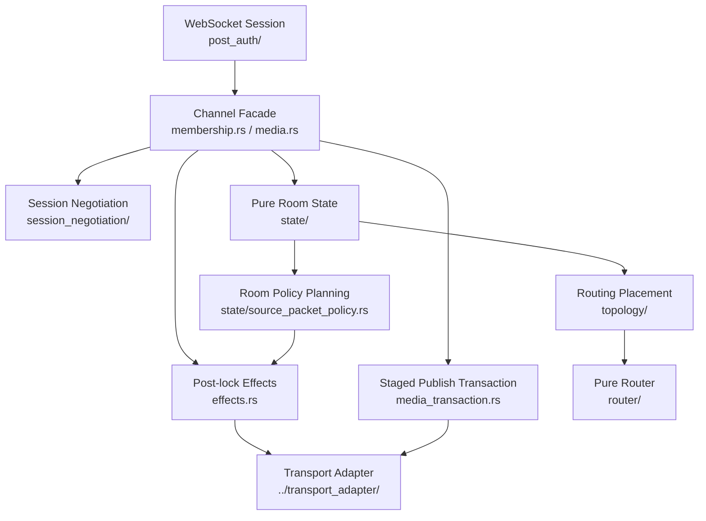
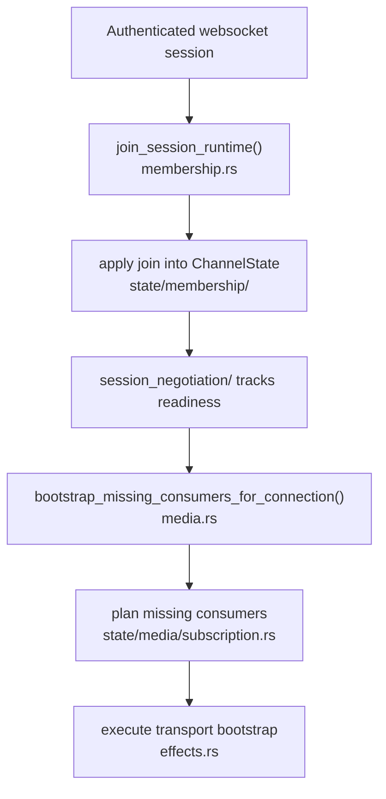
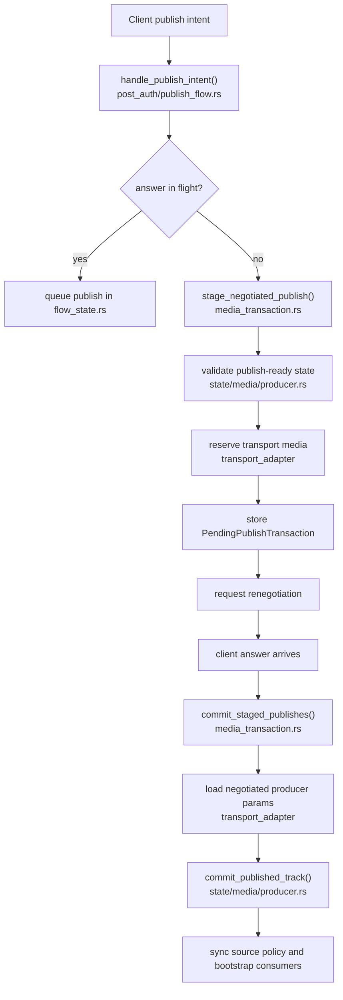
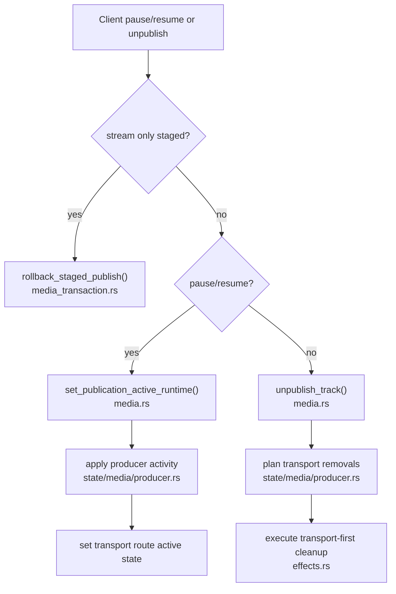
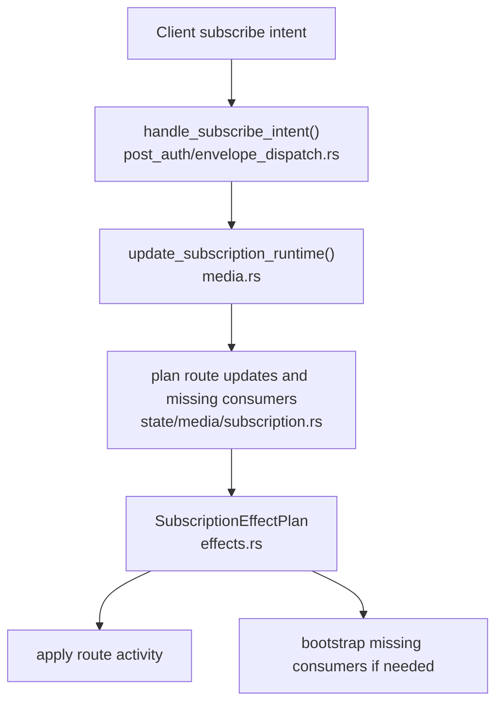
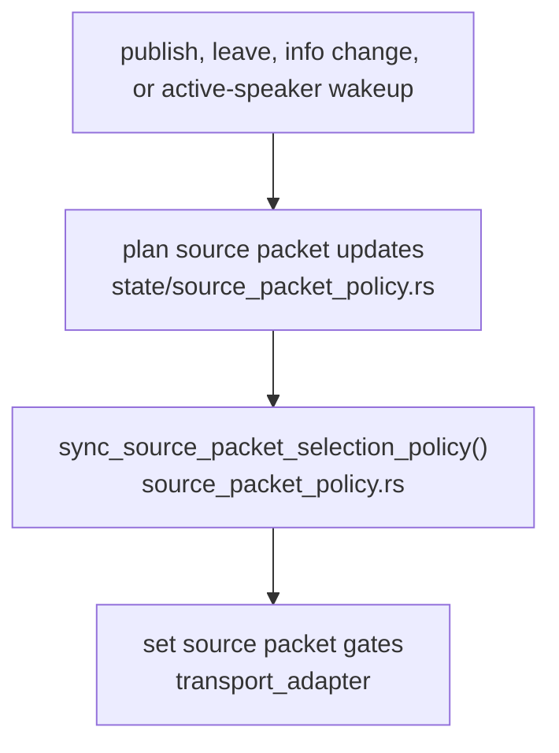

# Channel Architecture

`channel/` is analogus to `odoo/mail.discuss.channel`, it is a "room" (as it is sometimes call in other sfus) that contains members/participants (rtc sessions). It manage the way members interact with one another.

## Purpose

Its main job is to turn authenticated session intent into room-level state transitions without leaking websocket flow control or transport mechanics into the room model.

It sits between:

- websocket session orchestration in [`../websocket_server/session_protocol/post_auth/`](../websocket_server/session_protocol/post_auth/)
- the pure room model in [`state/`](./state/)
- post-lock side effects in [`effects.rs`](./effects.rs) and [`media_transaction.rs`](./media_transaction.rs)
- router placement and router bridging in [`topology/`](./topology/) and [`router_state/`](./router_state/)
- the runtime transport boundary in [`../transport_adapter/`](../transport_adapter/)

## Ownership Rules

The high-level split is:

- [`membership.rs`](./membership.rs): join, leave, close, disconnect, presence and readiness-triggered room sequencing
- [`media.rs`](./media.rs): room-facing media intents for publish, unpublish, subscribe and bootstrap recovery
- [`media_transaction.rs`](./media_transaction.rs): staged publish ownership across the offer/answer round-trip
- [`effects.rs`](./effects.rs): post-lock transport, diagnostics and fanout work
- [`state/`](./state/): pure room state, validation, planning and room-owned indexes
- [`session_negotiation/`](./session_negotiation/): per-session readiness state
- [`source_packet_policy.rs`](./source_packet_policy.rs): async orchestration for room-owned source policy
- [`state/source_packet_policy.rs`](./state/source_packet_policy.rs): pure planning for active-speaker and featured-session policy
- [`router_state/`](./router_state/) and [`topology/`](./topology/): bridge from room state into the pure router

The practical rule is:

- if the question is "when should this happen for one websocket session?" start in `post_auth/`
- if the question is "what is the room trying to do?" start in `membership.rs` or `media.rs`
- if the question is "is this state transition legal?" go into `state/`
- if the question is "what happens after the state change?" check `effects.rs` or `media_transaction.rs`

## Structure

## Main Flows

### 1. Session Join and Readiness

Files:

- websocket admission and post-auth session orchestration: [`../websocket_server/session_protocol/post_auth/`](../websocket_server/session_protocol/post_auth/)
- room-facing join, leave, close and disconnect sequencing: [`membership.rs`](./membership.rs)
- per-session readiness state: [`session_negotiation/mod.rs`](./session_negotiation/mod.rs)
- readiness-triggered consumer bootstrap: [`media.rs`](./media.rs)

This flow owns:

- joining a session into the room
- replacing an older connection for the same session id
- tracking publish-ready and consume-ready state
- running late-join or readiness bootstrap once a session is actually able to consume

Why it is split this way:

- websocket admission knows about connection lifecycle
- `membership.rs` knows about room membership semantics
- `session_negotiation/` keeps readiness explicit and local to one concept
- `state/media/subscription.rs` owns the pure planning for new consumer routes

### 2. Publish a New Stream

Files:

- websocket publish intent and renegotiation timing: [`../websocket_server/session_protocol/post_auth/publish_flow.rs`](../websocket_server/session_protocol/post_auth/publish_flow.rs)
- session-scoped queued publish ownership: [`../websocket_server/session_protocol/flow_state.rs`](../websocket_server/session_protocol/flow_state.rs)
- staged transport-media ownership: [`media_transaction.rs`](./media_transaction.rs)
- pure validation and final producer commit: [`state/media/producer.rs`](./state/media/producer.rs)
- room-facing media entrypoints: [`media.rs`](./media.rs)

This is the most important flow to understand because it is intentionally split across three layers.

The split is:

- websocket code decides when a publish should be queued, staged, committed, or rolled back
- `media_transaction.rs` owns the staged transport-media lifecycle across negotiation
- `state/media/producer.rs` decides whether the producer may become live in room state

The key invariant is that a publish is not live just because transport media was reserved.
It becomes live only after:

1. the answer landed
2. negotiated producer parameters were loaded
3. `commit_published_track(...)` accepted the final state transition

That is why `publish_flow.rs` and `media_transaction.rs` both exist.

### 3. Pause, Resume and Explicit Unpublish

Files:

- live producer activity changes: [`media.rs`](./media.rs)
- pure producer activity state transitions: [`state/media/producer.rs`](./state/media/producer.rs)
- explicit unpublish effect execution: [`effects.rs`](./effects.rs)

This flow covers already-live producers.
It does not use the staged publish transaction unless the stream is still waiting on commit.

The main design choice here is that explicit unpublish removes transport media first.
That keeps the system from leaving routable media alive if a later room-state cleanup step fails.

### 4. Subscribe and Download State Changes

Files:

- subscribe intent dispatch: [`../websocket_server/session_protocol/post_auth/envelope_dispatch.rs`](../websocket_server/session_protocol/post_auth/envelope_dispatch.rs)
- room-facing subscribe entrypoint: [`media.rs`](./media.rs)
- pure route and bootstrap planning: [`state/media/subscription.rs`](./state/media/subscription.rs)
- post-lock transport execution: [`effects.rs`](./effects.rs)

Subscribe is simpler than publish.
There is no staged consumer transaction that survives an answer round-trip.

This path owns:

- toggling download state for existing consumers
- reserving missing consumer bootstrap work
- reusing the same subscription planning for late join, readiness bootstrap and publish-triggered bootstrap

There is no `subscribe_flow.rs` because subscribe does not currently need websocket-side queued state or a staged transaction boundary.

### 5. Room-Owned Source Packet Policy

Files:

- pure planning: [`state/source_packet_policy.rs`](./state/source_packet_policy.rs)
- async orchestration against the transport adapter: [`source_packet_policy.rs`](./source_packet_policy.rs)
- runtime wakeup source: [`../transport_adapter/source_policy.rs`](../transport_adapter/source_policy.rs)

This flow owns:

- active-speaker camera selection
- featured-session projection
- diffing room policy decisions against current transport packet gates

This is room-owned policy, not packet-loop logic.
The transport layer reports speaker activity, but the room decides what that means for source selection.

## Random notes

- The room model in [`state/`](./state/) should stay pure room state.
- Transport calls should not happen under the channel lock.
- Websocket session flow should not dictate room internals.
- Publish is intentionally more complex than subscribe because publish crosses an offer/answer gap with reserved transport media.
- Effects and staged transactions exist to keep rollback and cleanup explicit instead of rebuilding state by guesswork after async work fails.

## Related Files Outside `channel/`

- post-auth websocket session owner: [`../websocket_server/session_protocol/post_auth/controller.rs`](../websocket_server/session_protocol/post_auth/controller.rs)
- websocket flow state: [`../websocket_server/session_protocol/flow_state.rs`](../websocket_server/session_protocol/flow_state.rs)
- runtime transport ports: [`../transport_adapter/ports.rs`](../transport_adapter/ports.rs)
- runtime transport adapter: [`../transport_adapter/runtime_adapter.rs`](../transport_adapter/runtime_adapter.rs)
- top-level runtime map: [`../../../internal-documentation/o-sfu/ARCHITECTURE.md`](../../../internal-documentation/o-sfu/ARCHITECTURE.md)
